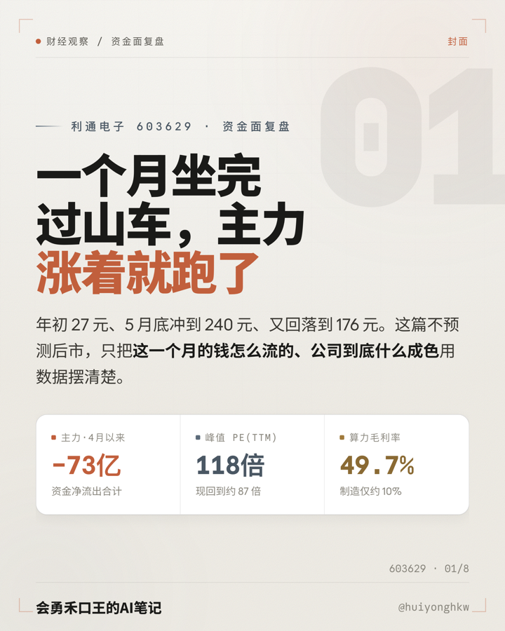
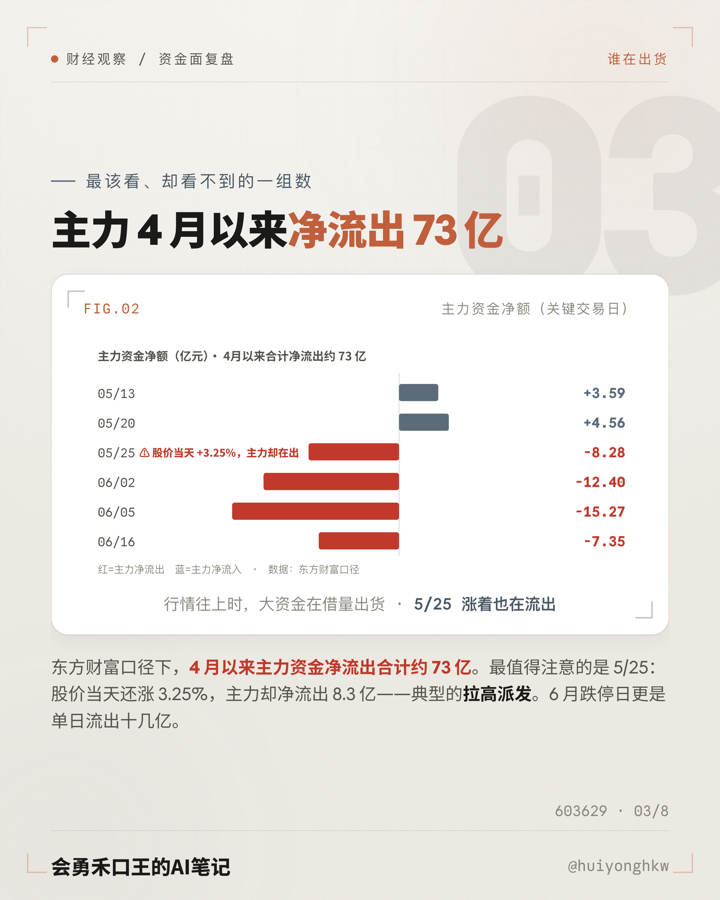
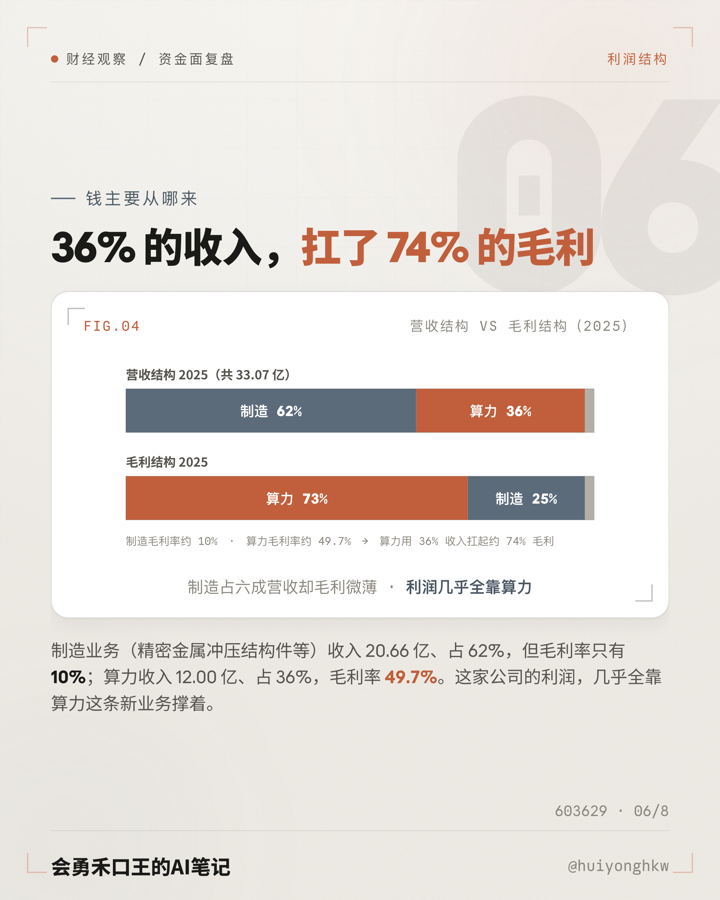

# 个股公开数据速读 · Skill（hekouwang-stock-data-reader-skill）

输入一个 A 股代码 → 用 [akshare](https://github.com/akfamily/akshare) 拉公开数据（资金流 / 龙虎榜 / 估值band / 财务三表 / 主营构成 / 北向 / 日K）→ 算出固定指标体系 → 产出「中立事后复盘」形态的财经贴图 / 公众号长文 / 头条三件套。

**内置金融合规护栏**：不荐股、不预测涨跌、不给买卖点，自动套风险提示条。是 Claude Code / Claude Agent 的可复用 Skill，也是「3 天一只·公开数据速读」财经栏目的发动机。

<p align="center">
  
  <br><sub>↑ 真实演示：装好依赖 → 输入一个代码 → 取数 → 算内核 → 出一套报告贴图</sub>
</p>

## 核心价值 · 凭什么不一样

市面上的「个股分析」工具/Skill 大多停在两类：要么只**拉价格 + 财报摘要**（新闻级，散户自己也能查），要么直接**给买卖点/评级**（荐股，合规雷区、既没法公开发也没法商用）。这套走第三条路：

**① 挖的是「资金博弈内核」，不是新闻**
借鉴 [`daily_stock_analysis`](https://github.com/ZhuLinsen/daily_stock_analysis) 的多源数据层思路，扒散户**看不到**的硬数据——主力资金净流入 / **拉高出货**、龙虎榜**席位结构**（游资通道盘 vs 机构长线）、北向持股、估值分位、**分部毛利结构**。回答的是"谁在出货、利润真不真、估值透支没"，而不是复述涨跌新闻。

**② 合规护栏内置 —— 唯一能「公开发布且不踩金融红线」的产出器**
不荐股、不预测涨跌、不给买卖点/评级，自动套风险提示条。这正是它能上公众号/头条、能商用、能免责的关键。多数分析工具张口就给"决策建议"——那是持牌业务，自媒体一发就违规。

**③ 数据 → 洞察 → 可发布图文，一条龙**
别的工具丢给你一堆 JSON / 仪表盘；这套直接出**能发的成品**——V2 米白「数据控制台」风的 8 贴图 / 公众号长文 / 头条三件套，改改文案即可发布。

**④ 零门槛、可栏目化**：akshare 免费公开数据源、**无需任何 API key**；一行命令、3 天一只，天生适配「个股复盘」内容栏目。

### 与 `daily_stock_analysis` 的关系

站在它的肩膀上（借鉴其多源数据层与"资金/筹码内核"思路），但**定位完全不同**：

| | daily_stock_analysis | 本 Skill |
|---|---|---|
| 定位 | AI 决策仪表盘（给**交易者**） | 合规内容产出器（给**内容创作者/财经自媒体**） |
| 输出 | 买卖点位 / 评分 / 风险警报 + 多渠道推送 | **中立复盘图文**（贴图/长文/头条），不给买卖点 |
| 合规 | 输出 AI 决策建议 | **内置护栏：不荐股 / 不预测 / 风险提示条** |
| 依赖 | 需 LLM API key + 通知渠道配置 | 取数/分析**零 key**（akshare 免费） |
| 视觉 | 仪表盘 | **出版级 V2 米白数据控制台风** |

> 一句话：**把"资金博弈内核"用合规、好看、能直接发的方式讲出来——这是别的分析工具不做、也不敢做的那一段。**

## 样例（V2 米白 · 数据控制台风）

> 输入 `603629`，一条流水线跑出的报告卡（成品观感，含 HUD 取景框 / 幽灵章节号 / 自制 SVG 图表）：

| 封面 | 主力资金面 | 利润结构 |
|---|---|---|
|  |  |  |

一份报告 8 张一套：价格轨迹 · 主力资金进出 · 龙虎榜结构 · 利润质量 · 利润结构 · 风险线索 · 风险提示条，可发公众号 / 头条。

## 安装

```bash
pip install -r requirements.txt    # akshare + pandas，建议 venv
```

放到 `~/.claude/skills/hekouwang-stock-data-reader-skill/`，Claude Code 会自动识别。触发词见 `SKILL.md`。

## 用法（三步）

```bash
python3 scripts/fetch.py  603629  out/603629     # 取数 → CSV + _report.json
python3 scripts/analyze.py        out/603629     # 算指标 → analysis.json
python3 scripts/build_report.py   out/603629 公司简称   # 出 8 贴图初稿（数字已对）
node    templates/screenshot.js   out/603629     # 截图 output/，出图即删 HTML
```

`build_report.py` 出的是**数字正确的初稿**；中立复盘文案按 `references/report-structure.md` 人工/LLM 润色后再截图交付。

## 指标体系

价格/市值/估值轨迹 · 主力资金进出（含"涨着出货"反差日）· 龙虎榜席位结构（通道盘 vs 机构长线）· 利润质量（净利 vs 经营现金流）· 利润结构（分部收入 vs 毛利占比）· 资产负债 · 风险线索。

## 生态依赖

- **取数 + 分析（`fetch.py` / `analyze.py`）= 自包含**：只需 `akshare + pandas`，独立可跑，产出 CSV 与 `analysis.json`，不依赖任何私有资源。
- **出图（`build_report.py`）软依赖 `hekouwang-content-factory`**（会勇禾口王内容工厂 · 私有视觉系统，不公开分发）：贴图复用它的**字体（Anthropic Sans/Mono + 思源黑体）、V2 米白 / V3 财经视觉规范、`_build.py` + `screenshot.js` 流水线**。`build_report.py` 里的字体路径默认指向本机的 content-factory。
  > ⚠️ **该依赖是 PRIVATE 私有仓库，非授权无法 clone / 获取**。本公开仓库只"点名"依赖，并不分发其字体与视觉流水线；且 Anthropic Sans 为专有字体，本就不可转分发。需要成品出图请见下方「付费」。
- **没有 content-factory 时**：`fetch` / `analyze` 照常用；`build_report` 因缺字体会样式回退（功能仍跑，但不是成品观感）。

## 免费 / 付费（Freemium）

- **免费**：取数引擎 + 指标计算（`fetch.py` / `analyze.py`）+ 报告结构与合规规范。拉数据、算指标、出结构化 `analysis.json`，开源可用。
- **付费（增值服务）**：**成品级数据报告图** —— V2 米白「数据控制台」风的 8 贴图 / 公众号长文 / 头条三件套（即上方样例）。它依赖私有视觉系统（品牌字体与版式，见「生态依赖」），**不随本仓库分发**。需要出图版报告，请联系 **@huiyonghkw** 获取。

> 一句话：**取数算账免费，出「好看的报告图」找我。**

## ⚠️ 合规（务必先读 `references/compliance.md`）

- 不荐股 / 不预测 / 不给买卖点；每份报告文末固定风险提示条。
- 个股报告**只走财经账号公众号/头条，不上小红书**（小红书只发零金融词的纯方法科普）。
- 营销号数字常错，一律以 akshare 财报/乐咕口径二次核实。

## 数据源踩坑

- 估值用 `stock_value_em`（旧版 `stock_a_indicator_lg` 已不在新版 akshare）。
- 日K走 sina 源（`stock_zh_a_daily`）。
- eastmoney `push2his`（资金流/筹码）在强制代理/受限网络可能被挡，正常机器直连即可。

## 文件

| 路径 | 作用 |
|---|---|
| `SKILL.md` | Skill 入口（Claude 读这个） |
| `scripts/fetch.py` | 取数引擎（任意代码） |
| `scripts/analyze.py` | 指标计算 → analysis.json |
| `scripts/build_report.py` | 据指标出 8 贴图初稿（V2 米白） |
| `templates/screenshot.js` | 1080×1350 @2x 截图，出图即删 |
| `references/compliance.md` | 金融合规护栏 |
| `references/report-structure.md` | 栏目固定报告结构 |

---
会勇禾口王的AI笔记 · @huiyonghkw　|　数据仅供研究，不构成投资建议
